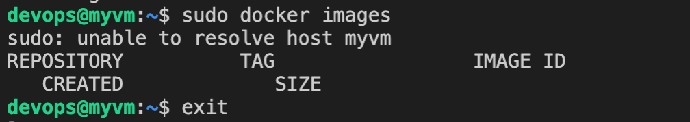

<div class="pull-left"> 
 
</div> 

---
<center> <b> <FONT size="5pt">DevOps-TP4 : Créer une Ressource Azure avec Terraform 

20220389 </FONT></b></center> 

---  
## 1) <u>Description du projet </u>  
Le TP4 a pour but de créer des ressources Azure en ligne de code avec Terraform. En effet, Terraform est un environnement logiciel d'« infrastructure as code ». Nous allons donc essayer de créer une machine virtuelle sur Microsoft Azure à l'aide de Terraform.
 
</div>  

## 2) <u>Fichier providers et initialisation du Terraform </u>
Le provider permet d'établir un lien pour permettre la communication avec un cloud comme AWS, Azure.

Dans `required_providers`, on indique qu'on souhaite faire la connexion.

Ensuite dans `provider "azurerm`, on indique le subscription id de notre abonnement.


Voici le code du provider.

```yml
terraform {
  required_providers {
    azurerm = {
      source  = "hashicorp/azurerm"
      version = "=3.0.0"
    }
  }
}

# Configure the Microsoft Azure Provider
provider "azurerm" {
  features {}
  subscription_id =  "765266c6-9a23-4638-af32-dd1e32613047"
}
```

Dans le terminal, on tape la commande `terraform init` pour appliquer 

## 3) <u>Les fichiers variable et data  </u>

Dans le fichier `variable.tf`, on déclare les variables. On a mis les informations telles que le nom de la ressource group. La ressource groupe est déjà crée donc pas besoin de le recréer.

Voici un exemple :
```yml
variable "region" {
  type = string
  default = "france central"
}
```

le nom de la variable est `region` de type `string` et il a pour valeur par défaut est `france central`.

Pour utiliser les ressources déjà créees, il faut les déclarer dans le fichier `data.tf`. 
Voici un exemple. Ici, on déclare le réseau virtuel :
```yml
data "azurerm_virtual_network" "network_tf" {
  name                = var.network
  resource_group_name = var.azure_resource_group
}
```

On indique le nom et la ressource groupe. 

## 4) <u>Le fichier net_interface</u>

il faut créer une interface réseau pour faire le lien entre la machine virtuelle et le sous réseau. Pour cela il faut créer une ressource. Ensuite, il faut créer une ressource pour la ip adresse public.

L'adresse public est alloué de manière static. L'adresse IP sera le même , une fois modifiée.

```yml
resource "azurerm_public_ip" "vm_public_ip" {
  name                = "vm-public-ip"
  location            = var.region
  resource_group_name = var.azure_resource_group
  allocation_method   = "Static"
}
resource "azurerm_network_interface" "terraform_network_interface" {
  name                = "terraform_network_int"
  location            = var.region
  resource_group_name = var.azure_resource_group
  

  ip_configuration {
    name                          = "internal"
    subnet_id                     = data.azurerm_subnet.subnet_tf.id
    private_ip_address_allocation = "Dynamic"
    public_ip_address_id = azurerm_public_ip.vm_public_ip.id
  }
}


```

la configuration de l'adresse IP, on indique l' id de l'adresse IP public

## 5) <u>vm.tf</u>

on crée notre ressource machine virtuelle dans ce fichier grâce à la balise `azurerm_linux_virtual_machine`. Ensuite on spécifie le OS avec la balise `source_image_reference`. 
On précise le `admin_username` pour se connecter. On indique aussi les informations comme les ressources group, l'interface réseau, la taille et le nom. 

on désactive la connection par mot de passe en mettant la variable `  disable_password_authentication` à true.

## 6) <u>Création de la clé ssh</u>

Pour la connexion à la machine virtuelle, on utilise la clé ssh.
```yml
resource "tls_private_key" "ssh_key" {
  algorithm = "RSA"
  rsa_bits  = 4096
}
```

On crée notre clé SSH avec la commande ci-dessus.
Ensuite lors de la création de la VM, on affecte la clé publique 
```yml
  admin_ssh_key {
    username   = var.user_admin
    public_key = tls_private_key.ssh_key.public_key_openssh
  }
```
Lorsqu'on fera notre connexion ssh, la clé publique de la VM, reconnaitra la clé privée indiqué.

Il ne faut pas oublier de récupérer la clé privée. Pour cela, il faudra le récupérer dans `output.tf`. 

```yml
output "private_key" {
  value     = tls_private_key.ssh_key.private_key_pem
  sensitive = true
}
```

En ligne de commande, on fait la commande suivante pour récupérer `terraform output -raw private_key > private_key.txt`

## 7) <u>Création de la VM</u>
on tape les commandes suivantes :

- `Terraform plan` : permet de voir si la ressources crées existe sur Azure.

- `Terraform apply` : permet de créer la ressources. 

## 8) <u>Connexion de la clé ssh</u>
Une fois que la ressource est crée, on peut faire notre commande ssh. 

`ssh -i private_key.txt devops@20.19.184.228`

- la private_key est la clé privée. 
- devops est le admin name
- 20.19.184.228 est l'adresse IP public (cette adresse sera différente)

<span style="color: #FF0000"> Problème rencontré</span> : J'ai rencontré un problème de droit avec le fichier private_key

<p style="float:right">
<p><span style="color: #26B260">Solution</span> : faire la commande `chmod 600 private_key.txt` pour changer les droit</p>
<div style="clear:both"></div>

Après ce changement, on peut se connecter à notre VM.

## 8) <u>Bonus</u>

- Nous avons crée des variables pour ne pas répéter les informations

- Pour régler les formats , on écrit la commande suivante : `terraform fmt` permet de mattre les fichier sous bonne format.

- Docker 

on a installé docker sur notre VM. Pour cela, il faut un fichier `cloud-init.yml`

ensuite lors de la création de la ressource VM, on met cette ligne de code pour installer dans le docker `custom_data = filebase64("cloud-init.yml")`.

On peut vérifier sur notre VM, en faisant une commande docker. Voici le rendu 
 

On a rencontré un problème en mettant notre projet sur GitHub. Vu que le dossier `.terraform` crée lors de l'initialisation est très lourd. On n'arrivais à le 'push' sur GitHub. On a donc mis les dossiers suivant dans le gitignore pour ne pas les mettre :
- tp4/.terraform
- tp4/.terraform/providers/registry.terraform.io/hashicorp/azurerm/3.0.0/darwin_amd64/terraform-provider-azurerm_v3.0.0_x5
- tp4/terraform.lock.hcl
- tp4/terraform.tfstate
- tp4/terraform.tfstate.backup


